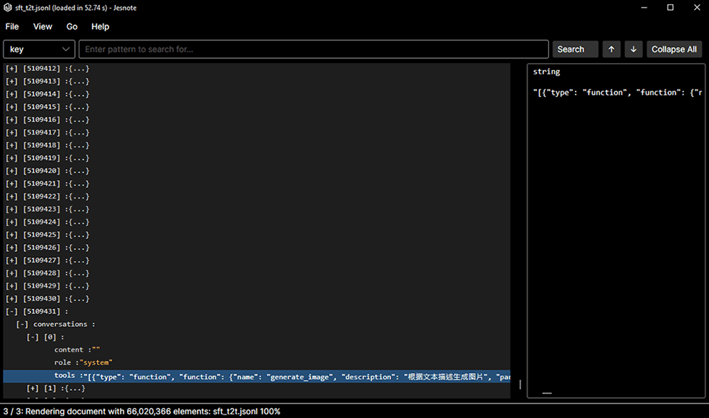

# Jesnote

  

  
<strong>打开和查看超大型 JSON | JSONL 文档的桌面应用。</strong>

  <a href="./README.md">English</a> | 中文

  
  
  
  
  

> 受到 [Janice](https://github.com/ErikKalkoken/Janice) 启发。

- 使用自定义虚拟化树视图，因此浏览大型文件时不需要为每个 JSON 元素创建一个 UI 节点。

## 功能

- 以可展开的树结构浏览 JSON 数据。
- 通过文件选择器、剪贴板、拖放或命令行参数打开文件。
- 使用通配符模式搜索键和值。
- 将选中的 JSON 分支导出到新文件，或复制到剪贴板。
- 查看超大型 JSON 文件，例如超过 2GB、包含 100MB+ 元素的文档。
- 可随时取消加载，同时避免严重的内存压力或 UI 卡顿。
- 支持浅色和深色主题。
- 支持语言：中文、英语、法语、日语、韩语、葡萄牙语、俄语、西班牙语。

## 要求

- Windows 10 或 MacOS (Apple Silicon) 且安装 .NET Runtime 8 或更高版本。

## 性能

- 无延迟加载。
- 完整加载并渲染一个包含 6600 万元素 12GB 大小的 JSONL 文件大约耗时 53 秒 (机械硬盘)。
- 实际速度会因设备硬件而异，尤其是 CPU、内存容量、磁盘/SSD 速度和散热状态。
- 以上数据仅为参考，不保证所有设备都能达到相同速度。

## 搜索模式

先选择搜索类型，再输入搜索模式：

- **Key**：搜索 JSON 的属性名。
- **String**：搜索 JSON 的字符串值。
- **Number**：搜索数值。
- **Keyword**：只搜索 `true`、`false` 或 `null`。

模式规则：

- 在 **String** 搜索中，直接输入纯文本时会按“包含”处理。
  - `user` 可以匹配 `user`、`username`、`current_user_id`。
- `*` 是通配符。
  - `user*` = 以 `user` 开头
  - `*user` = 以 `user` 结尾
  - `*user*` = 包含 `user`
- 在 **Key**、**Number** 和 **Keyword** 搜索中，仍然使用原来的通配符匹配行为。

搜索会从当前选中位置开始向后查找。如果在文档末尾之前没有找到结果，Jesnote 会询问是否要从顶部继续搜索。

## 快速开始

从 [Releases 页面](https://github.com/Elykdez/Jesnote/releases) 下载最新打包版本，解压后运行对应平台的可执行文件。

如果你想从源码运行或自行构建，请查看 [CONTRIBUTION.md](./CONTRIBUTION.md)。

## 计划

- 改进 UI
- 添加更多 JSON 编辑工具

## 致谢

- GPT 5.5 协助撰写部分代码和文档。
